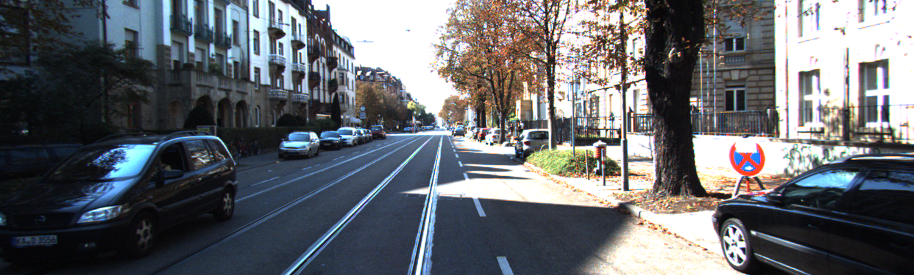
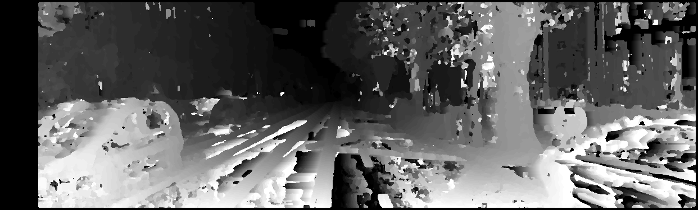
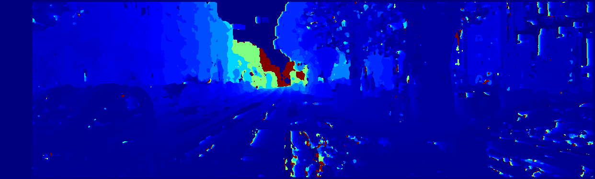
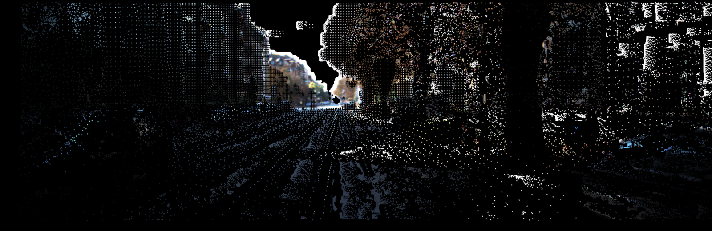

# Stereo Depth Estimation & 3D Reconstruction Pipeline

This project implements a stereo vision pipeline in C++ using OpenCV and PCL. Given stereo RBG image pairs (left and right images), this pipeline computes a disparity map using Stereo Block Matching (StereoBM), estimates depth and reconstructs a 3D point cloud based on the depth mapping.

<table>
  <tr>
    <td align="center">
      <br>
      <b>Original Stereo Image</b>
    </td>
    <td align="center">
      <br>
      <b>Disparity Map</b>
    </td>
  </tr>
  <tr>
    <td align="center">
      <br>
      <b>Depth Map</b>
    </td>
    <td align="center">
      <br>
      <b>3D Point Cloud</b>
    </td>
  </tr>
</table>

## Setup

This project requires:
- C++ (g++)
- OpenCV (`libopencv-dev`)
- PCL (`libpcl-dev`)

### Install Requirements

```sh
sudo apt update
sudo apt install build-essential
g++ --version                       # check installation
sudo apt install libopencv-dev      # install opencv
sudo apt install libpcl-dev         # install pcl
```

Make sure to set OpenCV and PCL include paths in your project settings.

### Compile and Run

In the root directory, compile all files from `src` folder and run using:

```sh
make
./main
```

### Kitti Dataset

[Kitti dataset stereo benchmark](https://www.cvlibs.net/datasets/kitti/eval_scene_flow.php?benchmark=stereo)

Download both `stereo 2015` and `calibration files` and place them in a folder called `kitti` in the project's directory.

- `stereo 2015`: contains all captured images;
- `calibration files`: include the camera's calibration parameters

## Project Structure
```
root/
├── images
├── kitti/
│   ├── data_scene_flow/
│   │   ├── testing/
│   │   │   └── ...
│   │   └── training/
│   │       └── ...
│   └── data_scene_flow_calib/
│       ├── testing/
│       │   └── ...
│       └── training/
│           └── ...
├── results/
├── src/
│   ├── main.cpp
│   └── ...
├── makefile
└── README.md
```

## Concepts:

- ***Pinhole camera model***: Camera forms a pinhole and every 3D world point projects to a single pixel on the image. [Explanation video](https://www.youtube.com/watch?v=_EhY31MSbNM)
- ***Optical center***: Point where the lens focuses (pinhole).
- ***Image sensor***: Where the picture forms.
- ***Focal length***: Distance from the camera's optical center to the image sensor. Tells how many pixels wide a scene point projects onto (lower focal length -> wider view's angle). Provides the scaling between real-world units (m, cm) and image units (pixels).

](./images/focal_length.jpg "Focal length")

- ***Principal point***: Center point in the image.
- ***Baseline***: Distance between cameras.

## Pipeline Steps

### 1. Kitti Data

Get data from Kitti, which includes left and right **images** along with the left camera's **focal length** and **image center**, and the **baseline**.

---

### 2. StereoBM (Block Matching)

The challeging part is matching pixels between the left and right images.

Single pixels can look similar and don't capture local structure, resulting in ambiguities when matching. Therefore, a patch or block of pixels is used to better capture texture and structure so matching becomes more distinctive and robust.

#### 2.1. Image Preprocessing

- **Convert images to grayscale**: Block matching algorithm relies on single-channel intensity values [0, 255], not color.
- **Normalize images**: Images may have different lighting or constrast. This ensures both have the same intensity range, which works better for later comparisons (SAD).

#### 2.2. Disparity Computation

**Disparity**: In stereio vision is the horizontal shift for a point between left and right images. If a point appears at $u_L$ in the left image and $u_R$ in the right image, disparity is:

$ d = u_L - u_R $

Meaning that closer objects have large disparity (large shift), while distant objects have small disparity (small shift).


**Algorithm steps**:

1. **Set parameters**: block/window size (must be odd for a well-defined center pixel), minimum disparity and number of disparities (search range).
2. **For each pixel in the *left image***:
    - Extract a block (window) centered on that pixel.
    - Slide that block across the possible disparity range in the *right image* along the same row (scanline).
    - At each shift, compute the matching/similarity score (in this case, it is a cost, SAD - sum of absolute differences).
    - The disparity (shift) with the highest similarity (lowest cost) is selected as the disparity for that pixel (winner-takes-all).
3. Repeat for all pixels (only valid where the window fits inside the image bounds).
4. Form a disparity map.

#### 2.3. Optimization

Apply median filter (kernel size equal to 3) to remove noise (wrong estimates or outliers) and smooth edges based on the median disparity neighboring value.

(Optional) Left-Right Consistency Check: Compute disparities for both images to check for disparity consistency and remove outliers.

---

### 3. Depth Estimation

Depth is computed from disparity using the stereo camera geometry:

$$
\text{depth} = \frac{f \cdot B}{d}
$$

Where:
- $ f $: focal length (pixels)
- $ B $: baseline (meters)
- $ d $: disparity (pixels)

Larger disparity means the object is closer, so depth is smaller. As baseline or focal length increases, we get better depth resolution.


---

### 4. 3D Point Cloud Reconstruction

Each pixel with disparity is projected into 3D using similar triangles:

$$
X = \frac{(u - c_x) \cdot Z}{f_x}
$$

$$
Y = \frac{(v - c_y) \cdot Z}{f_y}
$$

$$
Z = \text{depth}(u, v)
$$

Where:
- $(u, v)$: pixel coordinates  
- $(c_x, c_y)$: principal point (image center)  
- $f_x, f_y$: focal lengths  
- $Z$: depth as computed above

Find pixel offset from center of the image, travel $Z$ units in depth, and scale to world units with $f$. Allowing to create a 3D point cloud.

## StereoBM Limitations

- **Half-occlusions:** Objects visible only in one image cannot be matched.
- **Fronto-parallel assumption**: Assume that the corresponding scene points lie on surfaces parallel to the image plane. When surfaces are not fronto-parallel, StereoBM’s performance decreases.
- **Tradeoff:** Window size must be balanced. Too small leads to noise, while too large leads to lose of details and border bleeding (border is not exactly at the right place).
- **Ambiguities:** Textureless/repetitive regions are difficult for matching.
